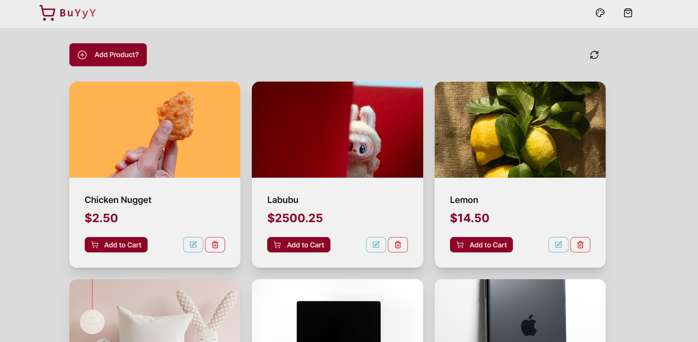
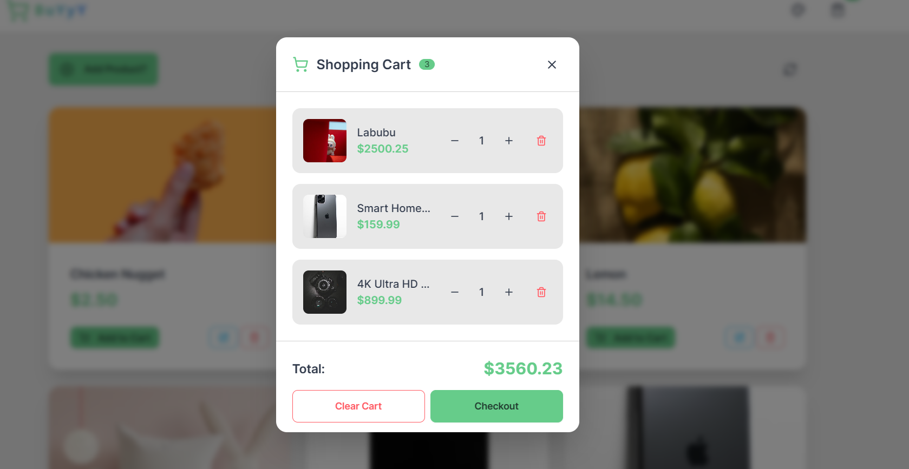
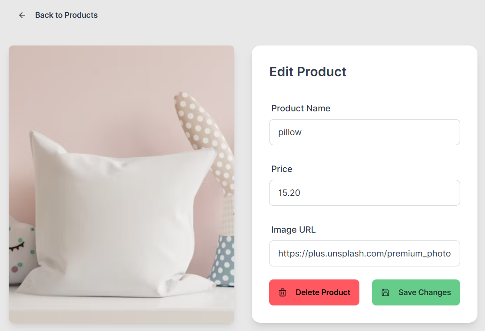

# 🛍️ BuYyY

A modern e-commerce platform built with the PERN stack (PostgreSQL, Express.js, React, Node.js). Features a beautiful UI with theme customization and a fully functional shopping cart.

## 📸 Preview





## ✨ Features

- 🛒 **Shopping Cart** - Add, remove, and manage items with persistent storage
- 🎨 **29+ Themes** - Real-time theme switching with DaisyUI
- 📱 **Responsive Design** - Works perfectly on all devices
- ⚡ **Real-time Updates** - Instant product and cart management

## 🛠️ Tech Stack

**Frontend:** React 19, Vite, Tailwind CSS, DaisyUI, Zustand  
**Backend:** Node.js, Express.js, PostgreSQL, Arcjet

## 🚀 Quick Start

```bash
# Install dependencies
npm install
cd frontend && npm install

# Set up environment variables
cp .env.example .env

# Start development
npm run dev
```

## 📝 Feedback (pls)

Your thoughts, feedback, and guidance are incredibly welcome! I'm also open to collaboration if you're interested in contributing or have ideas to share. Do connect/.pls
As a newcomer to React, this project was built to learn PostgreSQL and explore full-stack development. The development process involved extensive use of gpt (Gemini) for learning and problem-solving.

## 📧 Contact

- **Email:** asf1k.til@gmail.com
- **GitHub:** [@safwansatil](https://github.com/safwansatil)

---

**Hey, very new to React and made this with a lot of help from my friend, Gemini** 
